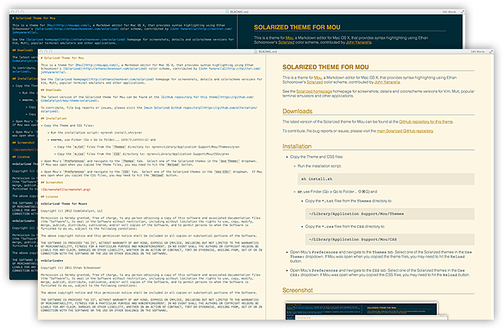

# Solarized Theme for Mou

This is a theme for [Mou](http://mouapp.com/), a Markdown editor for Mac OS X, that provides syntax highlighting using Ethan Schoonover's [Solarized](http://ethanschoonover.com/solarized) color scheme, contributed by [John Yanarella](http://twitter.com/johnyanarella).

See the [Solarized homepage](http://ethanschoonover.com/solarized) homepage for screenshots, details and colorscheme versions for Vim, Mutt, popular terminal emulators and other applications.

## Downloads

The latest version of the Solarized theme for Mou can be found at the [GitHub repository for this theme](https://github.com/CodeCatalyst/mou-theme-solarized).

To contribute, file bug reports or issues, please visit the [main Solarized GitHub repository](https://github.com/altercation/solarized).

## Installation

1. Run `install.sh` like so:

        sh install.sh

    or

    a. Copy the `*.txt` files from the `Themes` directory to:

        ~/Library/Application\ Support/Mou/Themes

    b. Copy the `*.css` files from the `CSS` directory to:

        ~/Library/Application\ Support/Mou/CSS

3. Open Mou's `Preferences` and navigate to the `Themes` tab.  Select one of the Solarized themes in the `Use Theme:` dropdown.  If Mou was open when you copied the theme files, you may need to hit the `Reload` button.

4. Open Mou's `Preferences` and navigate to the `CSS` tab.  Select one of the Solarized themes in the `Use CSS:` dropdown.  If Mou was open when you copied the CSS files, you may need to hit the `Reload` button.

## Screenshot

## License

**Solarized Theme for Mou**

Copyright (c) 2012 CodeCatalyst, LLC

Permission is hereby granted, free of charge, to any person obtaining a copy of this software and associated documentation files (the "Software"), to deal in the Software without restriction, including without limitation the rights to use, copy, modify, merge, publish, distribute, sublicense, and/or sell copies of the Software, and to permit persons to whom the Software is furnished to do so, subject to the following conditions:

The above copyright notice and this permission notice shall be included in all copies or substantial portions of the Software.

THE SOFTWARE IS PROVIDED "AS IS", WITHOUT WARRANTY OF ANY KIND, EXPRESS OR IMPLIED, INCLUDING BUT NOT LIMITED TO THE WARRANTIES OF MERCHANTABILITY, FITNESS FOR A PARTICULAR PURPOSE AND NONINFRINGEMENT. IN NO EVENT SHALL THE AUTHORS OR COPYRIGHT HOLDERS BE LIABLE FOR ANY CLAIM, DAMAGES OR OTHER LIABILITY, WHETHER IN AN ACTION OF CONTRACT, TORT OR OTHERWISE, ARISING FROM, OUT OF OR IN CONNECTION WITH THE SOFTWARE OR THE USE OR OTHER DEALINGS IN THE SOFTWARE.

**Solarized**

Copyright (c) 2011 Ethan Schoonover

Permission is hereby granted, free of charge, to any person obtaining a copy of this software and associated documentation files (the "Software"), to deal in the Software without restriction, including without limitation the rights to use, copy, modify, merge, publish, distribute, sublicense, and/or sell copies of the Software, and to permit persons to whom the Software is furnished to do so, subject to the following conditions:

The above copyright notice and this permission notice shall be included in all copies or substantial portions of the Software.

THE SOFTWARE IS PROVIDED "AS IS", WITHOUT WARRANTY OF ANY KIND, EXPRESS OR IMPLIED, INCLUDING BUT NOT LIMITED TO THE WARRANTIES OF MERCHANTABILITY, FITNESS FOR A PARTICULAR PURPOSE AND NONINFRINGEMENT. IN NO EVENT SHALL THE AUTHORS OR COPYRIGHT HOLDERS BE LIABLE FOR ANY CLAIM, DAMAGES OR OTHER LIABILITY, WHETHER IN AN ACTION OF CONTRACT, TORT OR OTHERWISE, ARISING FROM, OUT OF OR IN CONNECTION WITH THE SOFTWARE OR THE USE OR OTHER DEALINGS IN THE SOFTWARE.
